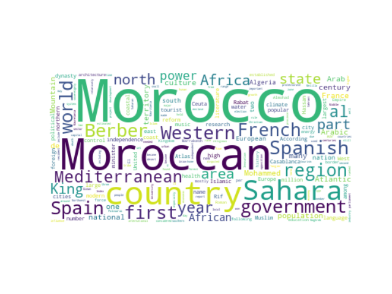

# Web scraping Wikipedia pages and generating a Word Cloud plot.

## Project Description

This code does web scparing of any Wikipedia page and then shows a Word Cloud type of plot of the most used words in the Wikipedia article.

The code uses Beautiful soup for webscraping and the wordcloud library for generating the plot.

- In this example : the Wikipedia page of "Morocco"

