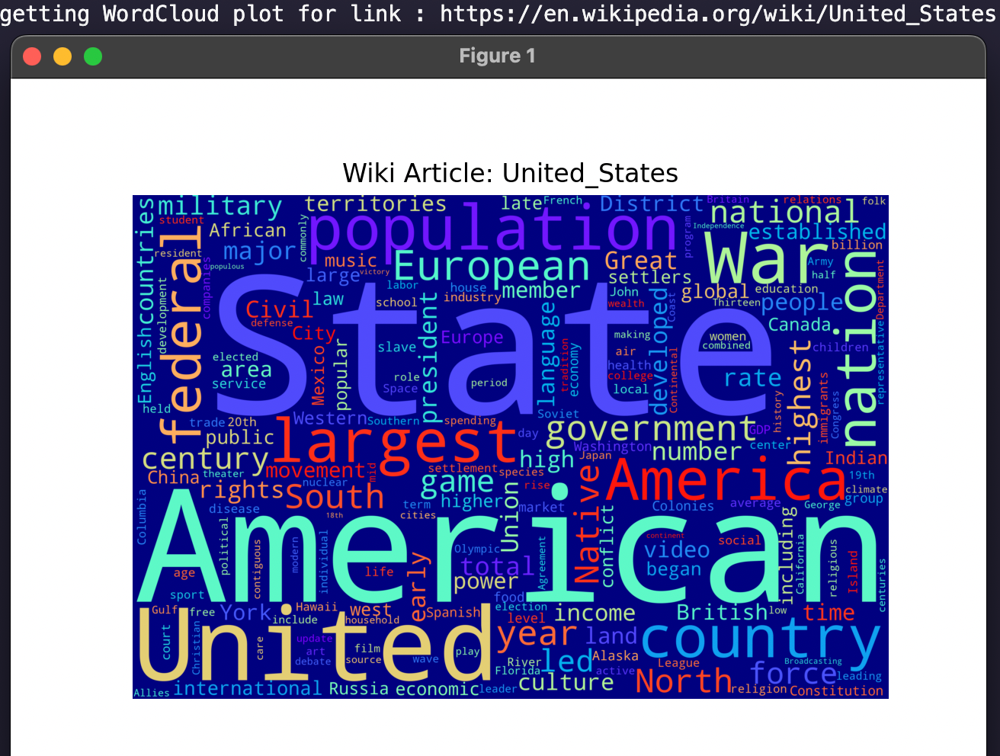
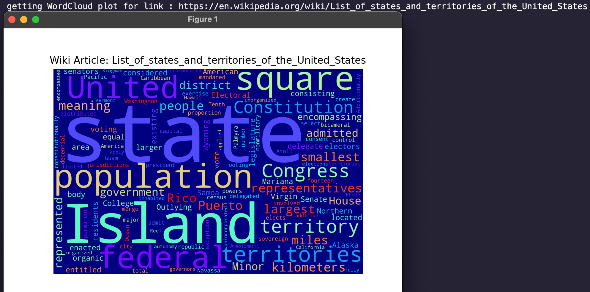
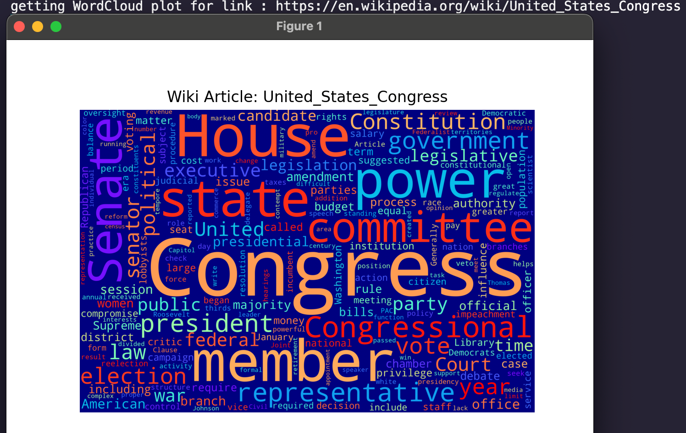
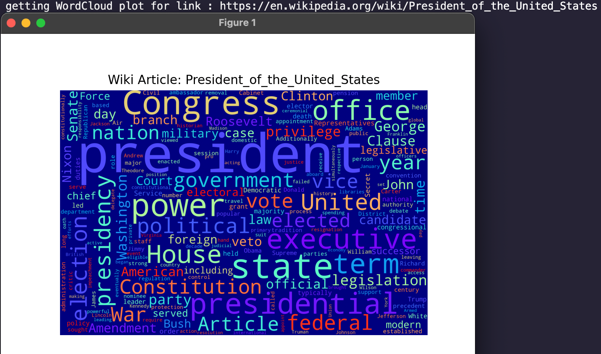
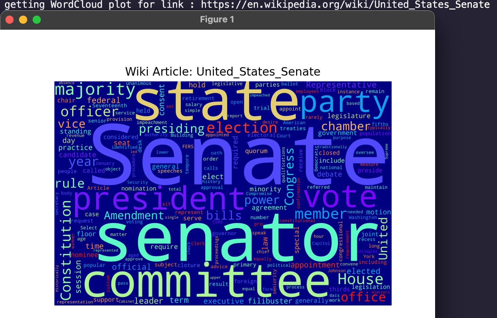
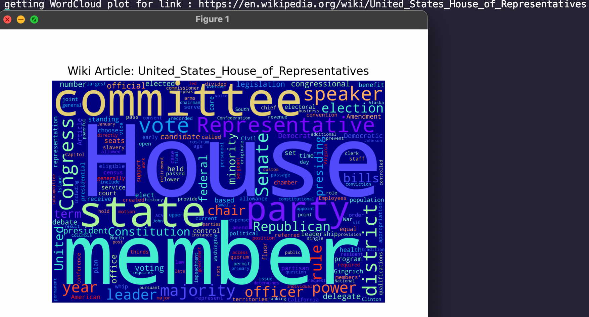
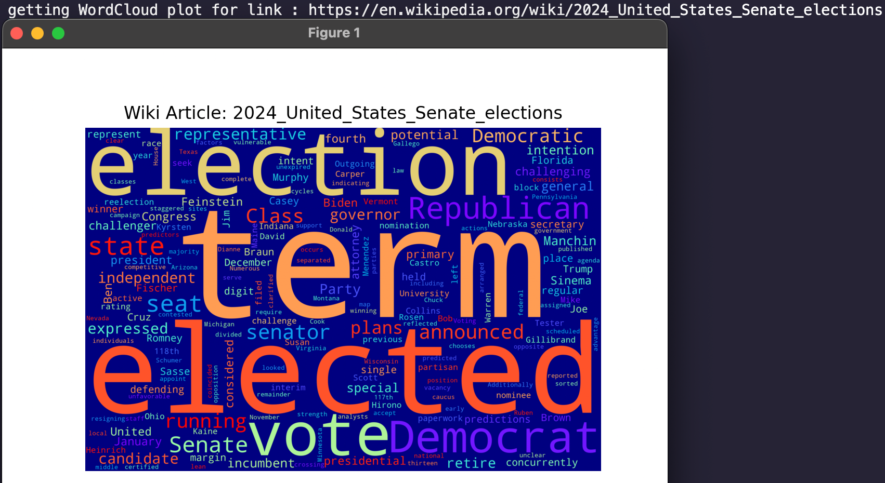
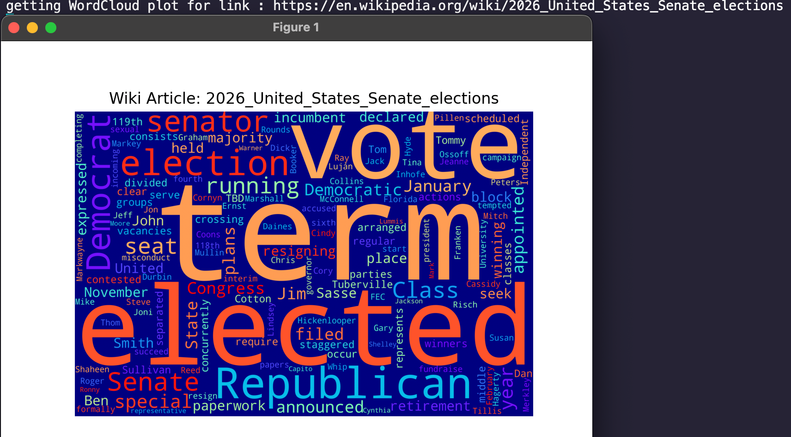
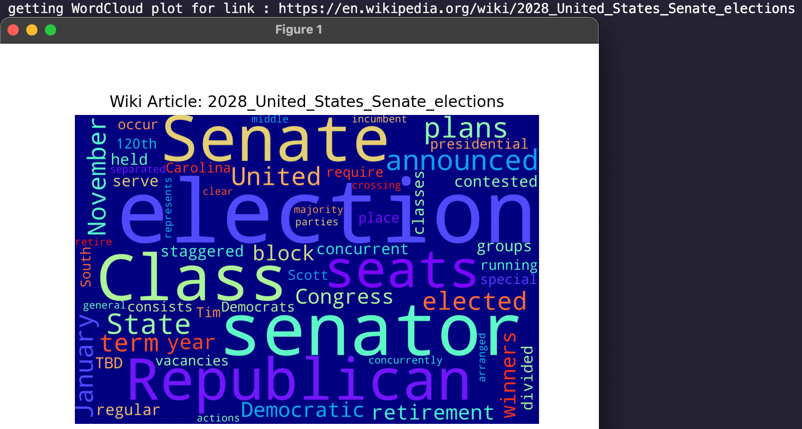
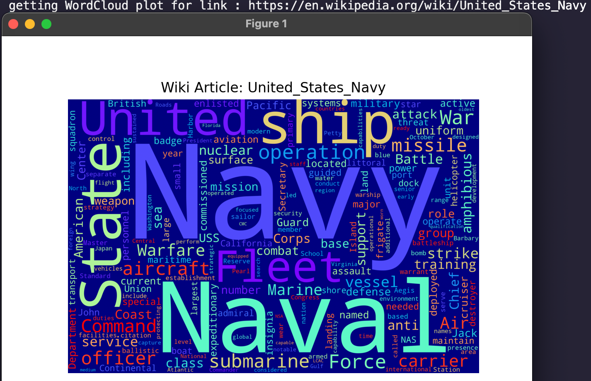

# Web scraping data from all the Wikipedia pages related to a specific "term" and generating their WordCloud plots.

## Project description
This code does web scparing of all of the Wikipedia pages related to a specific "term" that you can choose and then shows WordCloud type of plot of the most used words in the found Wikipedia articles.

\
The code uses Beautiful soup for webscraping, the wordcloud library for generating that specific type of plot and the wikipedia api library for finding url links related to the chosen "term" you want to find the wikipedia info of.

## Disambiguation of the chosen term
The code expects Wikipedia.Disambiguation error when the "term" chosen is not very precise. For example if you choose to find all wikipedia articles related to "strawberry" you need to write [Strawberry fruit](https://en.wikipedia.org/wiki/Strawberry) in order to avoid disambiguation of other kind of *"Strawberries"* like [Strawberry, a community in Arizona](https://en.wikipedia.org/wiki/Strawberry,_Arizona) and [Strawberry, a river in Arkansas](https://en.wikipedia.org/wiki/Strawberry_River_(Arkansas))

## Demonstration
Term chosen : **United states**

\

